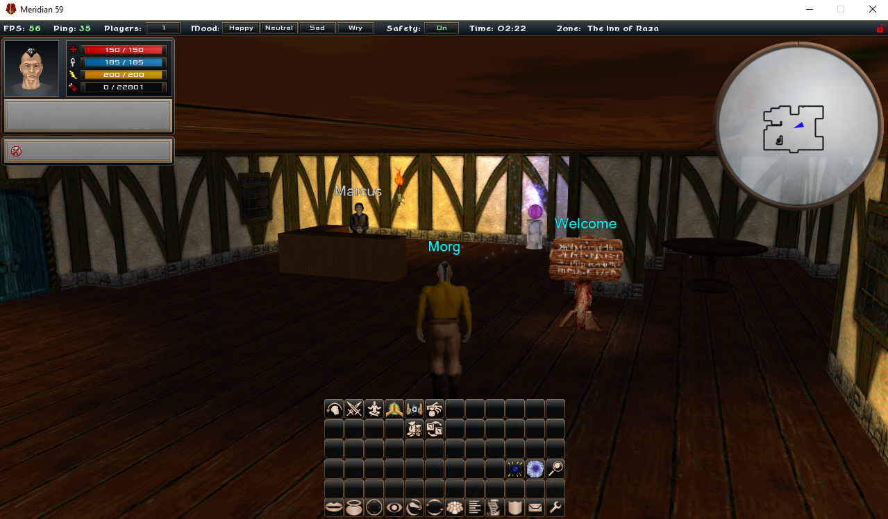
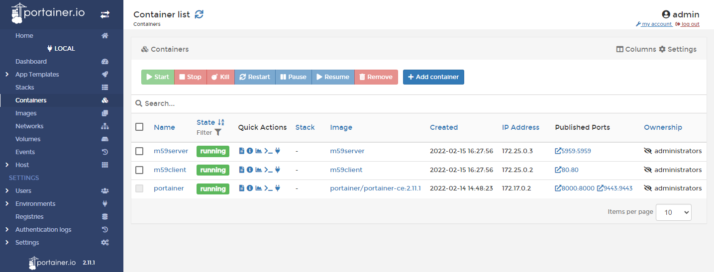
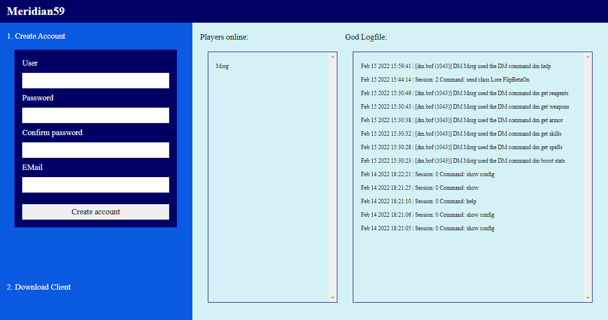

# Meridian59-Build

Build your own Meridian59 server by using a container based deployment.

## Prerequisites

- Clone the Meridian59 server from [here](https://github.com/andygeiss/Meridian59_105_2.9.git) to your local machine into a folder named `meridian59-base`.
- Clone the Meridian59 Ogre client from [here](https://github.com/andygeiss/meridian59-dotnet.git) to your local machine into a folder named `meridian59-dotnet`.
- Checkout the `main` branch on both repositories and compile each project by using VisualStudio 2017 with its required dependencies (can be automatically downloaded).

## Configuration

- Setup your `M59_HOST` and `M59_DEVUSER` in `scripts/config.ps1`.

## Bundle from source

- Compile the patcher and the publisher: 
    
        scripts/compile.ps1

- Prepare the server and client for the deployment: 

        scripts/prepare.ps1

- Pack the required files as an archive named `server.zip`: 

        scripts/pack.ps1

- Deploy the archive to your server: 

        scripts/deploy.ps1

- Login into your server.
- Unzip the archive from your home directory into a target location like `/opt/meridian59`:

        mkdir -p /opt/meridian59
        unzip server.zip -d /opt/meridian59/

- Install Docker and Portainer (optional) and build the docker images:

        ./docker/install-docker.sh
        ./docker/install-portainer.sh

        ./docker/build-images.sh

## Run as docker

        ./docker/run-container.sh

## Finally check the web server and portainer

